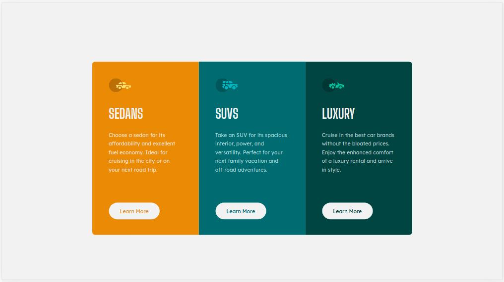

# Frontend Mentor - 3-column preview card component solution

This is a solution to the [3-column preview card component challenge on Frontend Mentor](https://www.frontendmentor.io/challenges/3column-preview-card-component-pH92eAR2-). Frontend Mentor challenges help you improve your coding skills by building realistic projects. 

## Table of contents

- [Overview](#overview)
  - [The challenge](#the-challenge)
  - [Screenshot](#screenshot)
  - [Links](#links)
- [My process](#my-process)
  - [Built with](#built-with)
  - [What I learned](#what-i-learned)
  - [Continued development](#continued-development)
  - [Useful resources](#useful-resources)
- [Author](#author)
- [Acknowledgments](#acknowledgments)

**Note: Delete this note and update the table of contents based on what sections you keep.**

## Overview

### The challenge

Users should be able to:

- View the optimal layout depending on their device's screen size
- See hover states for interactive elements

### Screenshot

### Links

- Solution URL: [Solution URL](https://www.frontendmentor.io/solutions/3column-preview-card-component-solution-html5-css3-flexbox-9Wi2jBJny)
- Live Site URL: [Live Site URL](https://3-column-preview-card-component-main-phi.vercel.app/)

## My process

### Built with

- Semantic HTML5 markup
- CSS custom properties
- Flexbox
-- [BEM](https://en.bem.info/methodology/) - BEM methodology
- [Styled Components] (https://necolas.github.io/normalize.css/) - For styles

## Author

- Frontend Mentor - [@DanielFabra](https://www.frontendmentor.io/profile/DanielFabra/)
- LinkedIn - [Daniel Fabra](https://www.linkedin.com/in/danielj-fabra/)
- Instagram - [@imfabra](https://www.instagram.com/imfabra/)

